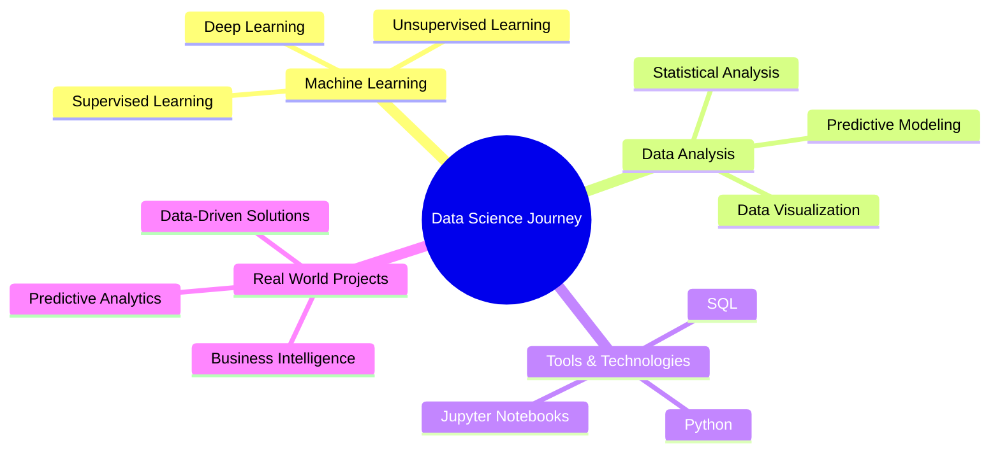

<div align="center">

# 🌟 Hi, I’m @esraa-elmaghraby 🌟
### Data Science Enthusiast & ML Explorer


</div>

---

## 🚀 About Me


```python
class EsraaElMaghraby:
    def __init__(self):
        self.name = "Esraa El-Maghraby"
        self.role = "Data Science Enthusiast"
        self.language_spoken = ["ar", "en"]
        self.interests = ["Data Science", "Machine Learning", "AI"]
        self.currently_learning = ["Deep Learning", "Neural Networks"]
        self.looking_for = "Real-world projects collaboration"
        
    def say_hi(self):
        print("Thanks for dropping by! Let's connect and build something amazing together!")

me = EsraaElMaghraby()
me.say_hi()
```

- 👀 **مهتمة بـ:** علم البيانات وتحليل البيانات
- 🌱 **أتعلم حالياً:** تعلم الآلة والذكاء الاصطناعي
- 💞️ **أبحث عن:** التعاون في مشاريع حقيقية ومفيدة
- 📫 **تواصل معي:** esraamaghrabi14@gmail.com
- ⚡ **حقيقة ممتعة:** أحب تحويل البيانات المعقدة إلى قصص مفهومة!

---

## 🛠️ Tech Stack & Tools

<div align="center">

### 📊 Data Science & Analytics


### 🤖 Machine Learning


### 🗄️ Databases & Tools


</div>

---

## 📈 GitHub Stats

<div align="center">
  
  
</div>

<div align="center">
  
  
</div>

---

## 🎯 Current Focus

<div align="center">



</div>

---

## 🌟 Featured Projects

<div align="center">

[](https://github.com/esraa-elmaghraby/data-analysis-project)
[](https://github.com/esraa-elmaghraby/ml-prediction-model)

</div>

---

## 🤝 Let's Connect!

<div align="center">

[](mailto:esraamaghrabi14@gmail.com)
[](https://github.com/esraa-elmaghraby)
[](https://linkedin.com/in/esraa-elmaghraby)


### 💫 "Data is the new oil, but insights are the refined fuel that powers innovation!" 💫


</div>

---

<div align="center">
  
</div>
